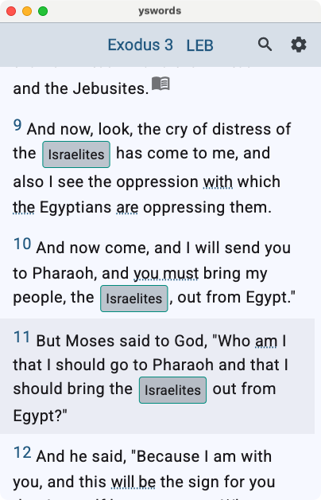
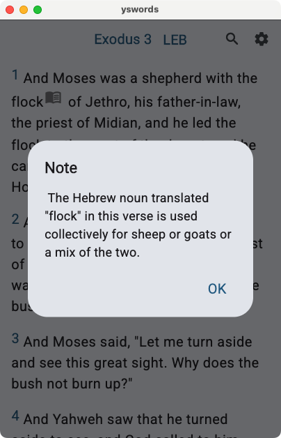
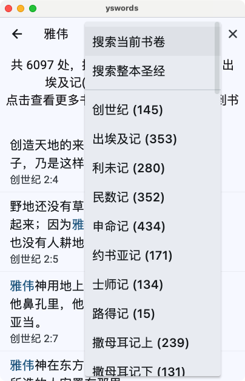
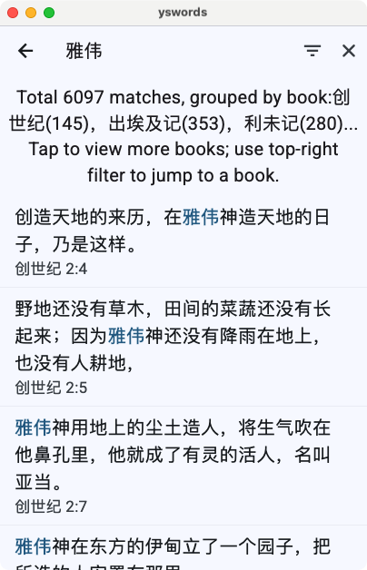
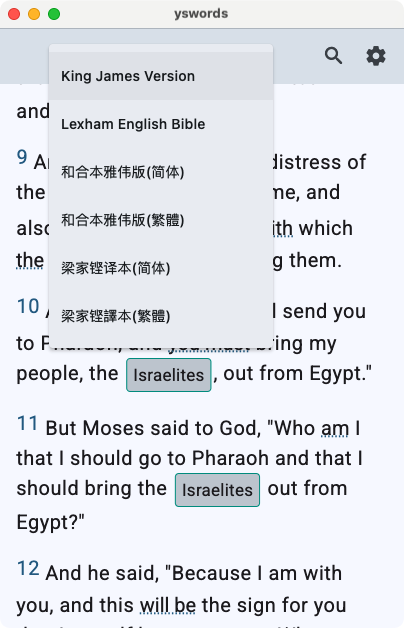
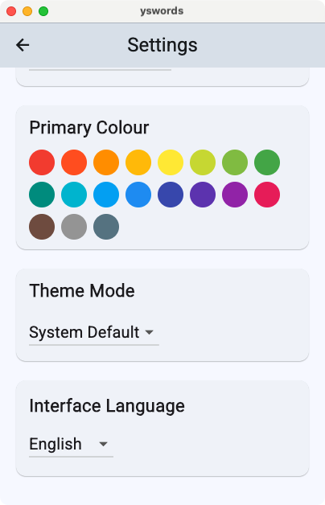
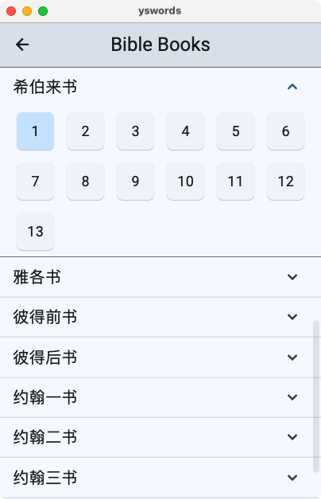
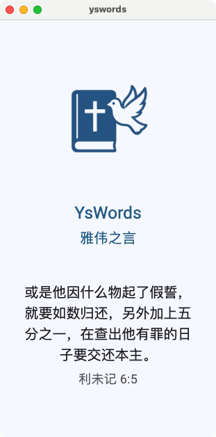

# YsWords – Yahweh’s Words

<p align="center">
  
</p>

*A bilingual, offline‑capable Bible reader built with Flutter.*

---

## ✨ Features

| Category   | Details |
|------------|---------|
| Versions   | KJV, LEB, 和合本雅伟版 (简 / 繁), 梁家铿译本 (简 / 繁) |
| Reading    | • Light / Dark / System theme<br>• Adjustable font family, size, line spacing<br>• Centred or left‑aligned reading mode |
| Navigation | • Swipe left / right to change chapter<br>• Floating chapter picker<br>• Previous / next arrows (auto‑hide on scroll) |
| Search     | • Book‑only or whole‑Bible search<br>• Highlighted results with book summary |
| Annotations| • `{…}` inline badges with linked `<note:…>` pop‑ups<br>• `[…]` dotted‑underline keywords |
| Copy & Share | • Tap verses to multi‑select<br>• Copy in **Plain**, **With Reference**, or **Devotional** formats |
| Persistence| • Last‑read position & user settings stored with `shared_preferences` |
| Updates    | • Optional auto‑download of new JSON assets (toggle in Settings) |
| Platforms  | Android, iOS, Web, macOS, Windows, Linux |

---

## 📸 App Screenshots

### 📖 Main Reading View & 📌 Note Popup

| Main Reading View | Note Popup |
|-------------------|------------|
|  |  |

---

### 🔍 Filter Dropdowns

<p align="center">
  
</p>

---

| 🔍 Search Results |  |
|------------------|-------------------|
|  |  |

---

| 📚 Version Switching | ⚙️ Settings Page |
|----------------------|------------------|
|  |  |

---

| 📘 Book & Chapter Picker | 🚀 App Splash Screen |
|--------------------------|-----------------------|
|  |  |

---

---

## 🛠️ Installation

```bash
# 1. Clone the repository
git clone https://github.com/SuyangLiuPaul/YsWords.git
cd YsWords

# 2. Install Flutter dependencies
flutter pub get

# 3. Run (choose one)
flutter run                    # Debug on default device
flutter run -d chrome          # Debug in browser
flutter build apk --release    # Release APK
```

*Requires **Flutter ≥ 3.22** and **Dart ≥ 3.2.***  

---

---

## 🌐 Live Web Demo

A production build of YsWords is hosted on Netlify:

```
https://yswords.netlify.app/
```

### How to Use

1. Open the URL in any modern browser (Chrome, Edge, Safari, Firefox).  
2. The first load downloads all required Bible JSON files; please wait for the progress indicator to complete.  
3. **Offline‑first:** the site installs a service worker – subsequent visits work without an Internet connection.  
4. On mobile, tap the browser menu → *“Add to Home Screen”* to install as a PWA.  
5. All features listed above (version switch, search, notes, copy formats) work exactly as in the mobile app.

> Tip: Press `Ctrl+S` (`⌘+S` on macOS) while the page is open to trigger the browser’s PWA install prompt if available.

---

## 📂 Project Structure

```
assets/                 Bible JSON files, fonts, images
lib/
 ├─ models/             Verse, Book, Chapter, AppSettings
 ├─ providers/          MainProvider (state + persistence)
 ├─ pages/              HomePage, BooksPage, SearchPage, SettingsPage …
 ├─ widgets/            VerseWidget, LocalisedBackButton, …
 ├─ services/           FetchVerses, FetchBooks, ReadLastIndex
 ├─ constants/          Book lists, UI strings
 └─ utils/              Clipboard helper, search formatter, etc.
pubspec.yaml            Dependencies & asset registration
```

---

## 🚀 Key Packages

| Package | Purpose |
|---------|---------|
| `provider`                   | State management |
| `get`                        | Navigation & lightweight routing |
| `scrollable_positioned_list` | Precise verse scrolling and jump‑to‑index |
| `shared_preferences`         | Persist settings & last position |
| `clipboard`                  | Copy selected verses to system clipboard |
| `intl`                       | Localised UI strings |

---

## 📖 Data Sources

| Language | Version | Source |
|----------|---------|--------|
| English  | KJV, LEB | Public domain / © Logos, distributed under licence |
| Chinese  | 《原文释经圣经》 (BIBLEXG) | <https://www.biblexg.com/> |
| Chinese  | 《雅伟的话》 和合本‑雅伟版 | <https://yahwehdehua.net/cn> |

All JSON files in `/assets/` are converted from the above sources with permission or where public‑domain applies. Each file header contains attribution and licence details.

---

## 🗋 JSON Naming Conventions

* `kjv.json`, `leb.json` – English versions.  
* `cuvs‑yhwh.json`, `cuvs‑yhwh‑tr.json` – Simplified / Traditional Chinese, divine name restored.  
* `BIBLEXG.json`, `BIBLEXG‑tr.json` – 原文释经圣经 Simplified / Traditional.  
* Files ending in `‑tr` are **Traditional Chinese**; files without are **Simplified**.

Each verse record:

```jsonc
{
  "book": "Genesis",
  "chapter": "1",
  "verse": "1",
  "text": "In the beginning God created the heavens and the earth.\n",
  "id": "001001001",
  "isParagraphStart": true
}
```

* `{…}`   – inline annotation badge  
* `[…]`   – dotted‑underline keyword  
* `<note:…>` – hidden note shown on tap

---

## ⚙️ Settings & Preferences

| Setting | Path | Meaning |
|---------|------|---------|
| Font family | **Settings → Reading → Font** | Switch between Roboto / Microsoft YaHei |
| Theme | **Settings → Appearance** | Light / Dark / System |
| Copy format | **Settings → Copy** | Plain / With Reference / Devotional |
| Update mode | **Settings → Advanced → Updates** | Online (service‑worker) vs Offline |

Stored locally via `shared_preferences` (`lib/services/app_settings.dart`).

---

## 🛠️ Build & Release

```bash
# Release Android APK
flutter build apk --release

# Release iOS (requires Xcode & certificate)
flutter build ios --release

# Optimised web build (for Netlify / Firebase)
flutter build web
```

To deploy on Netlify, point the site to `build/web` and enable “Redirects: /* /index.html 200”.

---

## 🗺️ Roadmap

- [ ] Verse audio playback (BIBLEXG MP3).
- [ ] Bookmark / Favourite verses.
- [ ] Inline cross‑references.
- [ ] Sync bookmarks via Firebase.
- [ ] Greek / Hebrew lexicon pop‑ups.

---

## 🤝 Contributing

1. Fork this repo and clone your fork.  
2. Create a feature branch:  
   ```bash
   git checkout -b feature/my-improvement
   ```  
3. Commit your changes with clear messages:  
   ```bash
   git commit -m "Add my improvement"
   ```  
4. Push and open a Pull Request.

Please run `flutter format .` before committing to maintain code style.

---

## 📜 Licence

YsWords is released under the MIT Licence.  
Scripture texts remain © their respective publishers. See `/assets/*` for licence details.

---

- Lexham English Bible © Logos Bible Software.  
- 《原文释经圣经》 © Bible Exegesis Ministry (<https://www.biblexg.com/>). Used with permission.  
- 《雅伟的话》 和合本‑雅伟版 © Yahweh De Hua Ministry (<https://yahwehdehua.net/cn>). Used with permission.  
- Fonts: Roboto (Google), Microsoft YaHei.  
- Inspiration from BibleWorks, YouVersion, and community Bible APIs.

---

## 👩‍💻 Quick Usage Guide

| Action | How‑to |
|--------|--------|
| Jump to book / chapter | Tap the book–chapter title in the AppBar or swipe horizontally |
| Change Bible version | Tap the version code in the AppBar (popup menu) |
| Search | Tap the **🔍** icon → enter keyword or reference |
| Copy verses | Tap verses to select → **Copy** FAB appears |
| Toggle reading mode | Settings → Reading → *Centre text* |
| Update assets | Settings → Advanced → *Enable updates* (requires Internet) |

---

## 🔄 Data Conversion & Update Pipeline

1. **Source acquisition** — Raw USFM / TXT files downloaded from the licensed providers (see *Data Sources*).  
2. **Conversion** — `tools/usfm_to_json.py` converts USFM → flattened JSON with paragraph & note tags.  
3. **Compression** — Output is minified, gzip‑compressed and placed in `/assets/`.  
4. **Integrity hash** — A SHA‑256 checksum is generated and stored in `assets/manifest.json`.  
5. **App update** — On launch, `FetchVerses` compares hashes and downloads newer assets if *Update mode* is set to **Online**.

Scripts live in `/tools/`; run:

```bash
python tools/usfm_to_json.py --input raw/usfm/Acts.usfm --output assets/Acts.json
```

---

## 📐 JSON Verse Schema

| Field | Type | Description |
|-------|------|-------------|
| `book` | `string` | Localised book name |
| `chapter` | `int / string` | Chapter number |
| `verse` | `int / string` | Verse number |
| `text` | `string` | Raw verse text with inline tags |
| `id` | `string` | 9‑digit canonical ID (`bbbcccvvv`) for quick look‑ups |
| `isParagraphStart` | `bool` | `true` if a new paragraph starts here |

### Inline Tag Grammar

```text
{…}       → Badge annotation, tappable
[…]       → Keyword with dotted underline
<note:…>  → Hidden note icon
```

Example (Genesis 1:2):

```jsonc
{
  "book": "Genesis",
  "chapter": "1",
  "verse": "2",
  "text": "Now<note: Or \"And\"> the earth was formless and empty, and darkness [was] over the face of the deep. And the Spirit of God [was] hovering over the surface of the waters.\n",
  "id": "001001002"
}
```

* Chapter / verse may be stored as strings (`"1"`) or integers (`1`) depending on source.  

---

## 🧑‍💻 Developer Environment

| Tool | Version |
|------|---------|
| Flutter | 3.22.x |
| Dart | 3.2.x |
| IDEs | VS Code, Android Studio |
| Formatter | `flutter format .` |
| Analyzer | `flutter analyze` |

Set up:

```bash
flutter doctor       # Verify toolchain
git clone https://github.com/SuyangLiuPaul/YsWords.git
cd YsWords
flutter pub get
```

---

## 🧪 Testing

* Unit tests: `flutter test`  
* Widget tests: `flutter test test/widgets`  
* Golden tests (UI diff): `flutter test --update‑golden`  
* Coverage: `flutter test --coverage` → view `coverage/lcov.info` in VS Code *Coverage Gutters*.

---

## 🛡️ Linting & Formatting

| Command | Purpose |
|---------|---------|
| `flutter analyze` | Static analysis (Dart lints) |
| `flutter format .` | Auto‑format code |
| `dart pub global run import_sorter:main` | Consistent import ordering |

A pre‑commit hook (`.githooks/pre‑commit`) runs these checks automatically.

---

## 🤖 CI / CD

A GitHub Actions workflow `.github/workflows/build.yml`:

1. Caches Flutter SDK.  
2. Runs *analyze* & *test*.  
3. Builds a web release artefact (`build_web.zip`) on every `main` push.  
4. Deploys to Netlify if `GITHUB_REF == 'refs/heads/main'`.

---

## 🐞 Troubleshooting

| Issue | Fix |
|-------|-----|
| **Xcode signing error** | Open `ios/Runner.xcworkspace`, set a valid team ID. |
| `ProcessException: Missing "libimobiledevice"` | `brew install libimobiledevice ideviceinstaller` |
| Blank screen on Web | Clear browser cache; ensure service worker version updated. |
| “load failed asset …” | Run `flutter clean && flutter pub get`; check `pubspec.yaml` assets path. |

---

## 📧 Contact

For questions, feedback, or licensing enquiries, please email:

**paul.sy.liu@gmail.com**

---

> “Your word is a lamp to my feet  
>  and a light for my path.” — *Psalm 119:105*