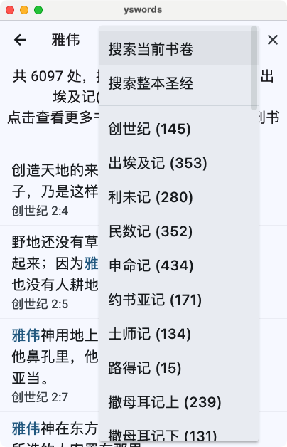

<h1 align="center">YsWords – Yahweh's Words</h1>

<p align="center">
  
</p>

<p align="center"><em>A bilingual Bible reader for Yahweh's words built with Flutter.</em></p>

---

## Features

| Category     | Details                                                                                                                 |
| ------------ | ----------------------------------------------------------------------------------------------------------------------- |
| Versions     | KJV, LEB, NASB, NIV, 和合本雅伟版 (简 / 繁), 和合本 (简 / 繁), 新译本 (简 / 繁), 原文释经圣经 (简 / 繁)                              |
| Reading      | Light / Dark / System theme; Adjustable font family, size, line spacing, menu scale; Verse-by-verse or Paragraph Flow reading mode |
| Highlights   | Mark verses with 6 colors (yellow, green, blue, pink, orange, purple); persistent across sessions                      |
| Navigation   | Swipe left/right to change chapter; Floating chapter picker; Previous/next chapter buttons; Grid/List view for books   |
| Search       | Book-only or whole-Bible search; Highlighted results with book summary                                                  |
| Annotations  | `{...}` inline badges with linked `<note:...>` pop-ups; `[...]` dotted-underline keywords; Book icon notes              |
| Copy & Share | Tap verses to multi-select; Copy in **Plain**, **With Reference**, or **Devotional** formats                            |
| Persistence  | Last-read position, highlights & user settings stored with `shared_preferences`                                         |
| Platforms    | Android, iOS, Web, macOS, Windows, Linux                                                                                |

---

## App Screenshots

| Main Reading View & Multi-select                                                                   | Note Popup                                                                             |
| -------------------------------------------------------------------------------------------------- | -------------------------------------------------------------------------------------- |
|    |  |

| Search Results                                                                                    | Search Filter                                                                                         |
| ------------------------------------------------------------------------------------------------- | ----------------------------------------------------------------------------------------------------- |
|    |  |

| Version Switching                                                                                         | Settings Page                                                                                    |
| --------------------------------------------------------------------------------------------------------- | ------------------------------------------------------------------------------------------------ |
|    |     |

| Book & Chapter Picker                                                                                         | Splash Screen                                                                                       |
| ------------------------------------------------------------------------------------------------------------- | --------------------------------------------------------------------------------------------------- |
|  |        |

---

## Installation

```bash
# 1. Clone the repository
git clone https://github.com/SuyangLiuPaul/YsWords.git
cd YsWords

# 2. Install Flutter dependencies
flutter pub get

# 3. Run (choose one)
flutter run                    # Debug on default device
flutter run -d chrome          # Debug in browser
flutter build apk --release    # Release APK
```

Requires **Flutter >= 3.22** and **Dart >= 3.2**.

---

## Live Web Demo

A production build is hosted on Netlify:

```
https://yswords.netlify.app/
```

- Open in any modern browser (Chrome, Edge, Safari, Firefox).
- All Bible data is bundled — no download required on first load.
- On mobile, tap the browser menu -> "Add to Home Screen" to install as a PWA.

---

## Project Structure

```
assets/                 Bible JSON files, fonts, images
lib/
  models/               Verse, Book, Chapter, AppSettings
  providers/            MainProvider (state + persistence)
  pages/                HomePage, BooksPage, SearchPage, SettingsPage
  widgets/              VerseWidget, ParagraphGroupWidget, LocalizedBackButton
  services/             FetchVerses, FetchBooks
  constants/            Book lists, UI strings, text patterns, Bible versions
  utils/                Clipboard helper, search formatter, version mapper, verse span builder
pubspec.yaml            Dependencies & asset registration
```

---

## Key Packages

| Package                        | Purpose                                   |
| ------------------------------ | ----------------------------------------- |
| `provider`                     | State management                          |
| `get`                          | Navigation via GetX                       |
| `scrollable_positioned_list`   | Precise verse scrolling and jump-to-index |
| `scroll_to_index`              | Auto-scroll in BooksPage                  |
| `shared_preferences`           | Persist settings & last position          |

---

## Data Sources

| Language | Version                    | Source                                             |
| -------- | -------------------------- | -------------------------------------------------- |
| English  | KJV, LEB                   | Public domain / Logos Bible Software               |
| English  | NASB 2020, NIV 2011        | api.bible (requires API key)                       |
| Chinese  | 和合本, 新译本               | getbible.net (free public API)                     |
| Chinese  | 原文释经圣经 (BIBLEXG)      | https://www.biblexg.com/                           |
| Chinese  | 雅伟的话 和合本雅伟版        | https://yahwehdehua.net/cn                         |

All JSON files in `/assets/` are used with permission or where public-domain applies.

---

## JSON Verse Schema

Each verse record:

```json
{
  "book": "Genesis",
  "chapter": "1",
  "verse": "1",
  "text": "In the beginning God created the heavens and the earth.",
  "id": "001001001",
  "isParagraphStart": true
}
```

### Inline Tag Grammar

| Pattern | Rendered As |
| ------- | ----------- |
| `{text}` | Tappable colored badge annotation |
| `[text]` | Dotted-underline keyword |
| `<note:text>` | Book icon, tap to show note dialog |

Chapter/verse may be stored as strings or integers depending on source.

---

## Bible Versions

| Key | Name | Language | Filename | Paragraph Data (raw) | Paragraph Data (effective) |
| --- | ---- | -------- | -------- | -------------------- | -------------------------- |
| `kjv` | King James Version | English | `assets/kjv.json` | No | OT + NT replay |
| `leb` | Lexham English Bible | English | `assets/leb.json` | No | OT + NT replay for available verses |
| `nasb` | New American Standard Bible 2020 | English | `assets/nasb.json` | No | OT + NT replay |
| `niv` | New International Version 2011 | English | `assets/niv.json` | No | OT + NT replay |
| `cuvs-yhwh` | 和合本雅伟版 (简) | Simplified Chinese | `assets/cuvs-yhwh.json` | No | OT + NT replay |
| `cuvs-yhwh-tr` | 和合本雅伟版 (繁) | Traditional Chinese | `assets/cuvs-yhwh-tr.json` | No | OT + NT replay |
| `cuv` | 和合本 (简) | Simplified Chinese | `assets/cuv.json` | No | OT + NT replay |
| `cuv-tr` | 和合本 (繁) | Traditional Chinese | `assets/cuv-tr.json` | No | OT + NT replay |
| `cnv` | 新译本 (简) | Simplified Chinese | `assets/cnv.json` | No | OT + NT replay |
| `cnv-tr` | 新译本 (繁) | Traditional Chinese | `assets/cnv-tr.json` | No | OT + NT replay |
| `biblexg` | 原文释经圣经 (简) | Simplified Chinese | `assets/biblexg.json` | No; NT text only | NT replay |
| `biblexg-tr` | 原文释经圣经 (繁) | Traditional Chinese | `assets/biblexg-tr.json` | No; NT text only | NT replay |
| `biblexg-v2` | 原文释经圣经第二版 (简) | Simplified Chinese | `assets/biblexg-v2.json` | NT only (canonical source) | NT |
| `biblexg-v2-tr` | 原文释经圣经第二版 (繁) | Traditional Chinese | `assets/biblexg-v2-tr.json` | NT only (canonical source) | NT |

Default version on first launch: `cuvs-yhwh`.

**Paragraph mode note**: Paragraph metadata is shared at load time. The NT uses LJK2 (`biblexg-v2`) as the canonical source; the OT uses `assets/web-ot-paragraphs.json`, a derived map of 11,922 verse starts from the public-domain World English Bible USFM. `FetchVerses` replays both sources by english book name + `chapter:verse`, so paragraph layout is consistent across translations wherever the version includes those verses.

---

## Build & Deploy

```bash
# Build for web
flutter build web

# Build for Android
flutter build apk --release
```

### Deploy to Netlify (manual)

GitHub and Netlify are NOT linked. Deployment is manual:

```bash
# 1. Build locally
flutter build web

# 2. Deploy to Netlify
netlify deploy --prod --dir=build/web --auth $NETLIFY_AUTH_TOKEN --site $NETLIFY_SITE_ID

# 3. Push to GitHub
git push origin main
```

- **Live site**: https://yswords.netlify.app
- **Publish directory**: `build/web/`
- **SPA redirect**: configured in `netlify.toml`

Netlify does NOT run Flutter — the build must be done locally first.

---

## Contributing

1. Fork this repo and clone your fork.
2. Create a feature branch: `git checkout -b feature/my-improvement`
3. Commit your changes with clear messages.
4. Push and open a Pull Request.

Please run `flutter analyze` before committing.

---

## Developer Environment

| Tool      | Version           |
| --------- | ----------------- |
| Flutter   | 3.22+             |
| Dart      | 3.2+              |
| IDEs      | VS Code, Android Studio |
| Analyzer  | `flutter analyze` |

---

## License

YsWords is released under the MIT License.
Scripture texts remain copyright their respective publishers.

- Lexham English Bible (c) Logos Bible Software.
- 原文释经圣经 (c) Bible Exegesis Ministry (https://www.biblexg.com/). Used with permission.
- 雅伟的话 和合本雅伟版 (c) Yahweh De Hua Ministry (https://yahwehdehua.net/cn). Used with permission.
- Fonts: Roboto (Google), Microsoft YaHei.

---

## Contact

For questions, feedback, or licensing enquiries:

**paul.sy.liu@gmail.com**

---

> "Your word is a lamp to my feet and a light for my path." — Psalm 119:105
