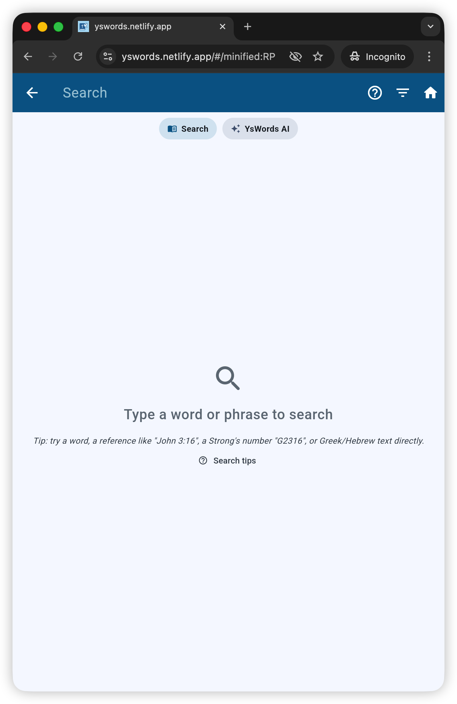
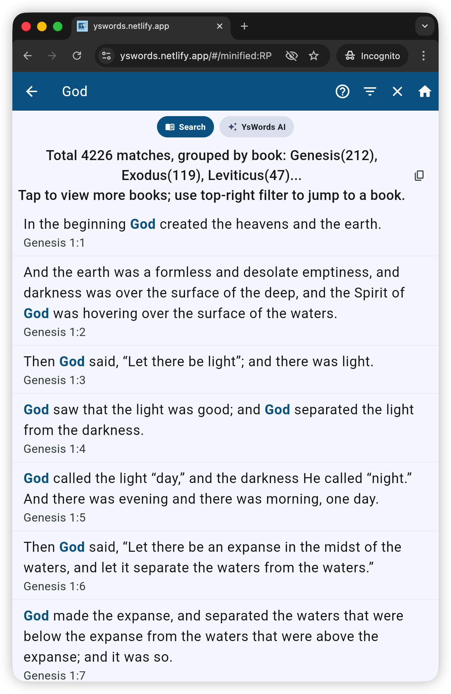
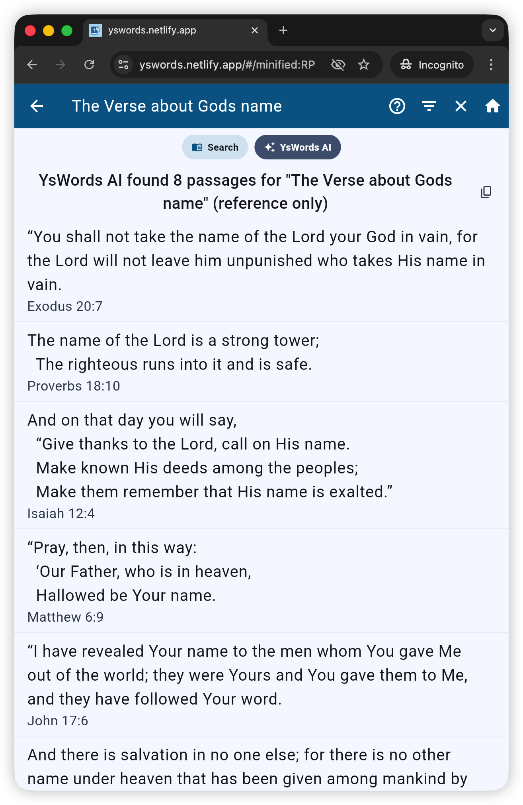
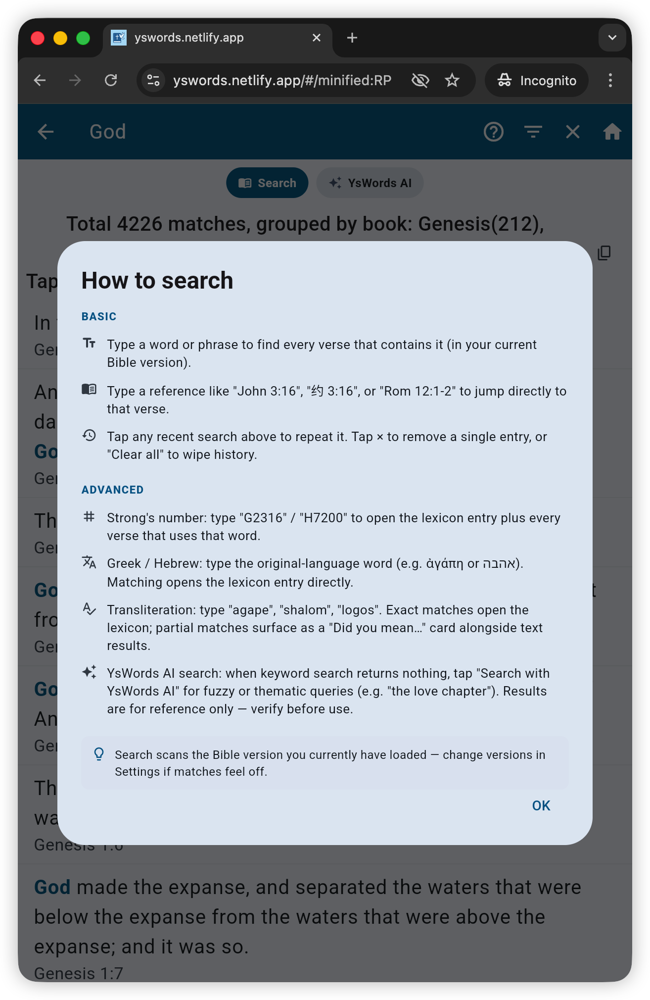
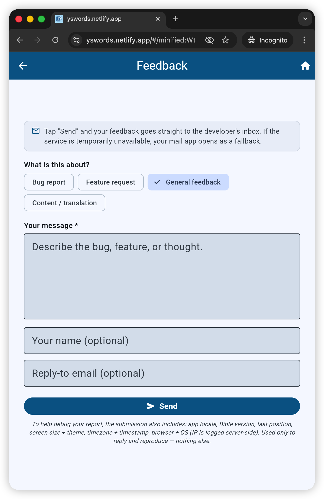
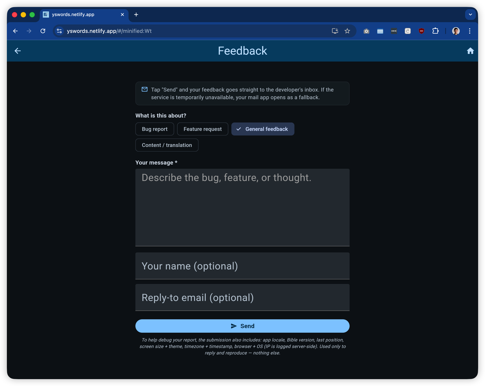
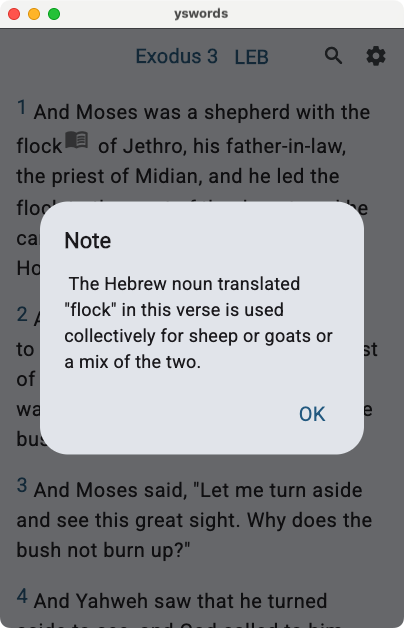

<h1 align="center">YsWords – Yahweh's Words</h1>

<p align="center">
  
</p>

<p align="center"><em>A bilingual Bible reader for Yahweh's words built with Flutter.</em></p>

<p align="center">
  <a href="https://yswords.netlify.app">
    
  </a>
  <a href="https://github.com/SuyangLiuPaul/YsWords/releases/latest">
    
  </a>
  
  
</p>

---

## Try it now

🌐 **<https://yswords.netlify.app>** — opens in any modern browser. No install, no sign-in needed. Optional Google sign-in syncs highlights / bookmarks / notes / last-read position across devices.

📱 On mobile, tap your browser's menu → **Add to Home Screen** to install as a PWA — full offline reading after one tap of the *Offline Pack* in Settings.

---

## Quick start

### For users — nothing to install
Open <https://yswords.netlify.app> and start reading. Tap any verse to copy / highlight / bookmark / get an interlinear word study. The dashboard's quick-links grid puts Search, Library, Statistics, Daily News, Bible Evidence, Family Tree, Bible Trivia, Songs, **Feedback**, and Settings one tap away.

### For developers — clone, run, ship
```bash
git clone https://github.com/SuyangLiuPaul/YsWords
cd YsWords
flutter pub get
flutter run -d chrome
```

To deploy to your own Netlify project:
```bash
flutter build web --release
netlify deploy --prod --dir=build/web --site=YOUR_SITE_ID
```

For cloud features (sync + AI + feedback email) to work in
production, see [**SETUP.md**](SETUP.md). The fastest path:

1. Open the deployed app → Settings → About → bottom →
   **"Run check"** diagnostic. It probes Firebase Auth, Realtime
   Database, and the AI proxy.
2. Any failing rows give one-click "Open Cloud Console" / "Open
   Firebase Console" / "Open Netlify env vars" deep-links straight
   to the page that fixes them.
3. The collapsible "One-time cloud setup walkthrough" right below
   the diagnostic explains each step with ⓘ details on why it
   matters and what breaks without it.
4. Optional: `bash scripts/enable-cloud-apis.sh` (or paste it into
   <https://shell.cloud.google.com>) auto-enables the Gemini API
   in one command.

The diagnostic + walkthrough live inside the app permanently —
once set up, you can ignore them. **End users never need to enable
any APIs themselves**; everything is at the Firebase project level.

---

## Features

| Category     | Details                                                                                                                 |
| ------------ | ----------------------------------------------------------------------------------------------------------------------- |
| Versions     | KJV, LEB, NASB, 和合本雅伟版 (简 / 繁), 和合本 (简 / 繁), 新译本 (简 / 繁), 原文释经圣经 (简 / 繁)                              |
| Reading      | Apple-glass reader controls; Light / Dark / System theme; Adjustable font family, size, line spacing, menu scale; Verse-by-verse or Paragraph Flow reading mode (default); Full-width reading on all devices; Grid view default for new users; Reading mode toggle in header on tablet+ |
| Highlights   | Mark verses with 6 colors (yellow, green, blue, pink, orange, purple); persistent across sessions                      |
| Bookmarks    | Bookmark + per-verse notes; visible inline indicator next to every flagged verse in both verse-by-verse and paragraph mode |
| Navigation   | Swipe left/right to change chapter; Floating chapter picker; Previous/next chapter buttons; Grid/List view for books with compact English/Chinese labels; Responsive grid for tablets/desktops; Collapsible sidebar for wide screens (≥600px) |
| Split View   | Two fully independent Bible panes; Side-by-side on tablet/desktop (≥600px) with draggable divider; Top-bottom on phone with draggable divider; Each pane has its own book, chapter, and version; Toggle in header |
| Search       | **Live search-as-you-type** with 250 ms debounce · Two explicit modes via chip strip: **Search** (text scan, also Enter default) and **YsWords AI** (Gemini-backed fuzzy/thematic, reference-only) · Direct-reference jump (`John 3:16`, `约 3:16`, `Rom 12:1-2`) · Strong's-# pattern (`G2316` / `H7200`) opens the lexicon page · Top-aligned **recent searches** with per-item delete · Bulk **Copy all results** to clipboard · Built-in **"?" help dialog** in your locale · Filter dropdown for whole-Bible vs current-book scope · Every keystroke resets to default scope (entire Bible) · **Tap a hit → smooth 350 ms scroll lands the verse 25 % from the top** with a bold `primaryContainer` wash + inline `►` arrow before the verse number in paragraph mode (auto-clears after 3.5 s) |
| Word Study   | Tap any verse → "Original" → word-by-word interlinear with Strong's, transliteration, gloss · Tap a chip → full lexicon entry, word family, synonyms, LXX cross-testament refs, concordance · **YsWords AI explanation** with adjustable scope: this verse / chapter / book / whole Bible / cross-testament / **deep exegesis (BDAG-level structured analysis)** — all reference-only · **Aramaic words highlighted** in Daniel 2:4-7:28, Ezra 4:8-6:18 + 7:12-26, Genesis 31:47, Jeremiah 10:11, plus NT transliterations (raca, talitha koum, abba, eloi, ephphatha, maranatha) · **Proper-noun complementary glosses** (English etymology + Chinese biblical identification side-by-side) |
| Annotations  | `{...}` inline badges with linked `<note:...>` pop-ups; `[...]` dotted-underline keywords; Book icon notes              |
| Section titles | Inline scripture-section headings with optional ⓘ context popovers — covers all 13 versions × 66 books                  |
| Book intros  | Collapsible historical-context card at the top of every chapter 1, bilingual                                            |
| Cross-refs   | Treasury of Scripture Knowledge (TSK) + OpenBible.info community votes — 29,319 source verses with their highest-voted to-references; surfaced via the cross-refs sheet on any selected verse |
| Bible Tools  | Originals overview · Strong's lookup · Word distribution table · Daily verse rotation (curated) · Languages card (Hebrew / Aramaic / Greek deep-dives with tappable passage links) |
| Bible Trivia | 68 curated entries on hidden patterns, acrostics, divine-name codes, numerical structures · Sorted by canonical Bible order · 4 schematic diagram types (Hebrew alphabet grid, chapter-counts bar chart, threefold sequence, numbered Hebrew words) for the most pattern-heavy entries |
| Bible Evidence | Browsable archive of 225 archaeology / manuscript / science / history finds with bilingual descriptions and scripture cross-link · **YsWords AI evidence search** ("Ask YsWords" with daily-rotating example queries based on today's evidence; Enter key submits — results reference-only) · Chapter-aware filter from inside the reader |
| Daily News   | Bilingual world / China / Australia headlines with full article body, YsWords-picked Bible verse, and reflection — refreshed hourly from the central data CDN |
| Cloud Sync   | Optional Google sign-in syncs highlights + bookmarks + notes via Firebase Realtime Database (own-write echo guard + content-hash skip — no flicker, minimal traffic); offline-first with merge-then-overwrite reconciliation · **BYOK Gemini key real-time sync** across signed-in devices (paste on Device A → appears on Device B in seconds, no restart; clear on Device A → clears on Device B too) |
| Offline Pack | 5-category pre-fetch (Bibles 70 MB / Sermons 26 MB / Tools 10 MB / Originals 31 MB / Maps 29 MB) — full offline use after one-tap download |
| Reload       | One-tap Reload from the floating-header overflow menu and the empty-reader scaffold so users never have to relaunch the app to recover from a load failure |
| Copy & Share | Tap verses to multi-select; Copy in **Plain**, **With Reference**, or **Devotional** (default — flows as one continuous paragraph with the reference in parens at the end, 灵修 / 抄经 friendly) formats                            |
| Feedback     | In-app feedback form (Dashboard → **Feedback** tile) with category chips · Submitted server-side via Resend → developer's inbox · No tab switch · Auto-attached diagnostics (locale / Bible version / position / screen / theme / timezone / browser / IP) · Signed-in users get an opt-in "Send a copy to me" checkbox; guests can type their email · Falls back gracefully to `mailto:` if the email service is unconfigured |
| Persistence  | Last-read position, highlights & user settings stored with `shared_preferences`; cloud sync layered on top              |
| Platforms    | Android, iOS, Web, macOS, Windows, Linux                                                                                |

---

## App Screenshots

> Captured 2026-05-07 against the v1.0.0 build. UI has shipped substantial polish since — see the HANDOFF banner for a complete v1.x release log. **v1.3.x highlights**: PageView chapter pager with per-page SPL + KeepAlive (v1.2.96 → v1.3.3), themed iOS/Android/macOS/web app icons that follow `primaryColor` (v1.2.96 → v1.2.98), per-category notification scheduler with local-TZ-correct fires (v1.3.0), daily-verse rotation epoch fix (v1.3.2), fine-grained rebuild scope via Selector + ValueNotifier (v1.3.5 + v1.3.15 + v1.3.16), navigation dedup (v1.3.6 → v1.3.8), YHWH name restored across 47 aux files (v1.3.11), version-gap UI (v1.3.12), Chinese exegesis prompt fix (v1.3.13), split-pane chrome cleanup + tighter chapter top gap (v1.3.14), haptic feedback + macOS ⌘ shortcuts (v1.3.17), 朗读/TTS feature removed (v1.3.19), avatar decode caps + responsive reading-column max-width on tablet/desktop (v1.3.20), **cross-platform error reporting via Resend (v1.3.21)**, **robustness bundle — GitHub Actions CI + silent-error reporting + iOS memory-pressure handler (v1.3.22)**, **test coverage on new infra → 134 / 134 (v1.3.23)**, **security baseline — CORS lockdown + CSP/HSTS/X-Frame + gitleaks in CI + Firebase rules audit (v1.3.24)**, **PWA install affordance with platform-aware copy + analyze strictness restored to zero infos (v1.3.25)**, **highlights / bookmarks / notes export as Markdown or JSON (v1.3.26)**, **CSP removed after the v1.3.24 → v1.3.28 whack-a-mole; defense-in-depth headers stay (v1.3.29)**, **BYOK → shared-key auto-fallback for all 3 AI functions (v1.3.30)**, **bundled Noto Sans CJK SC subset → fixes "X" tofu glyphs on web (v1.3.31)**, **mini-header backdrop + tap-to-scroll-to-top, platform-aware blur (v1.3.32 → v1.3.35)**, **wider reading-column caps for large tablets — Xiaomi Pad 7 Ultra: 51% margin → 11% (v1.3.33)** + **Strong's stub-gloss recovery for 18 lexicon entries (v1.3.33 + v1.3.36 dedupe)**, **note glyph is now a one-tap target opening the editor (v1.3.37)**, **CN-build native coexist scaffolding — Android product flavors + iOS bundle-ID patch script (v1.3.38)**, **note timestamp honesty — unknown stamps render as no time rather than fake "just now" (v1.3.39)**, **version-switch race fix + locale-aware default version: en→NASB, zh-Hant→CUVS-YHWH-TR, zh-Hans→CUVS-YHWH (v1.3.40)**, **cross-device sync for last-read position + 22 user-prefs fields via `lastRead` / `userPrefs` JSON blobs with newest-timestamp-wins merge (v1.3.41)**, **seed-write on every boot so sync isn't empty when device hasn't navigated (v1.3.42)**, **sermon-resume sync via `sermonId` field added to lastRead blob with write/read/dashboard-refresh wiring (v1.3.43 → v1.3.44)**, **🚨 EMERGENCY HOTFIX v1.3.45 — RTDB sync was 100% broken on prod for any user with legacy `plan.*` SharedPreferences entries; reading-plan feature was removed in v1.2.69 but `plan.activeId` / `plan.startMs` / `plan.useDate` / `plan.completed.*` keys still in sync schema; RTDB forbids `.` in keys → every sync write rejected → root cause of every "sync isn't working" complaint. Stripped plan.* from schema + added defensive `_isInvalidRtdbKey()` guard at snapshot collection AND right before `FirebaseDatabase.set()`**, **locale-aware default version actually persists (v1.3.46 — fresh-install locale wasn't written to prefs so en users got CUVS-YHWH; + one-time en→NASB migration)**, **APP_VERSION robustness cascade for the launchd overnight reinstall (v1.3.47 — 5-strategy fallback + a `~/.config/yswords/current-version` cache outside the TCC-blocked `~/Documents`)**, **web edge-strip CSS reset (v1.3.48 — `body{margin:0;background:#FFF8F6}` killed the white bands flanking the reader)**, **RTDB sync-flicker fix (v1.3.49 — `_onProfileChanged` no longer reset `_firstPullAfterSignIn` or re-ran on the reporter's own remote-apply writes, which had created an upload→echo→merge→upload loop)**, **AI "explain this verse" from the reading-pane selection bar + 3 fixes (v1.3.50 — `task:'versePlain'` mode on the existing aiExplainWord function; new `LeftAccentCard` ends the "borderRadius on a non-uniform border" crash class; ErrorReporter drops benign CanvasKit WebGL noise; Chinese exegesis hides English-only CBOL noise + collapses the derivation into a 英文参考 disclosure)**, **narrow-phone selection-bar overflow guard (v1.3.51)**, a **Phase-2 audit pass — sync-merge regression tests (RTDB newest-wins + plan.* key rejection), export-dialog responsive width fix, doc sync (v1.3.52)**, **dashboard-blank fix (v1.3.54) — `LeftAccentCard` (v1.3.50) drew its stripe with `Row(crossAxisAlignment: stretch)`, which threw during layout for the dashboard's `mainAxisSize.max Column` child inside a `ListView` and blanked everything below it; rewrote it to a `Positioned` stripe overlay (no stretch / no intrinsic pass) + added the regression test**, **AI-verse explanation polish (v1.3.55 → v1.3.57) — cold-start auto-retry, render in the scripture font so it reads as one piece with the verse, and a rewritten `buildVersePrompt` that forces clean flowing prose (no markdown outline / no leaked "快速思考" preamble) + a defensive client strip**, **CN build fix — `release_web.sh` now builds TWO bundles (international → en sites, `CHINA_MODE=true` → cn sites) so `yswords-cn` no longer ships Firebase/Google-sign-in that's useless behind the GFW**, and a **prod revert→re-push — both prod sites were rolled back to v1.3.47 during the blank-home investigation, then (once v1.3.54 confirmed the fix) re-pushed at v1.3.57: international → `yswords`, CHINA_MODE → `yswords-cn`; this also restored the prod `versePlain` AI function the native apps call**, **mini-reader header de-pilled — plain text, version centered (v1.3.58)**, **release-time stamp consistency (v1.3.59) — `kAppReleaseTime` is now stamped into source by `bump_version.sh` instead of injected per-build (an empty inject had blanked the About footer on the Mi Pad), and the footer renders a self-computed `UTC+10`-style offset instead of the platform-divergent `DateTime.timeZoneName`**, and the **2026-06-11 full audit (v1.3.60) — added the long-missing `<meta name="viewport">` to web/index.html (mobile browsers had been laying out at the legacy 980 px desktop width — a root cause of cross-browser format differences), silenced `debugPrint` in release builds (≈100 callsites were logging sync/auth detail to the prod web console), bounded every awaited RTDB op with a 20 s timeout so sync can't hang forever on flaky networks, extracted the AI-explanation cleanup into a tested pure function (`cleanAiExplanation`), and added 53 tests: responsive overflow smoke tests (About/Settings/Library/Dashboard × 320/390/768/1280), `parseReference` regressions (cross-chapter ranges, comma refs, single-chapter books, `;` chains, Chinese abbreviations) and the daily-verse NT-only fallback**. flutter test: 303 / 303 (incl. responsive overflow smoke tests for all 19 top-level pages × 4 widths). The screenshots below show the core layout that's still current; the welcome-page disclaimer card was removed in v1.2.5 and isn't shown.

| Dashboard — greeting + Read Bible + Verse of the Day                                                                                  | Quick-links grid (Search · Library · Bible Tools · Daily News · Bible Evidence · Sermons · Family Tree · Bible Timeline · Bible Trivia · Songs · Feedback · Settings) |
| ------------------------------------------------------------------------------------------------------------------------------------- | --------------------------------------------------------------------------------------------------------------------------------------------------------------------- |
|                                        |                                                      |

| Search modes — **Search** + **YsWords AI** chip strip                                                                  | Search results — count, grouped by book, with Copy-all                                                |
| ---------------------------------------------------------------------------------------------------------------------- | ----------------------------------------------------------------------------------------------------- |
|                             |        |

| YsWords AI — fuzzy / thematic verse lookup ("AI is only an aid")                                                       | "How to search" help dialog — Basic + Advanced                                                        |
| ---------------------------------------------------------------------------------------------------------------------- | ----------------------------------------------------------------------------------------------------- |
|                           |  |

| Word-by-word exegesis — Greek/Hebrew interlinear with Strong's chips                                                     | AI explanation card — verse-level commentary with length / scope controls                             |
| ------------------------------------------------------------------------------------------------------------------------ | ----------------------------------------------------------------------------------------------------- |
|                        |        |

| Feedback form — direct to developer inbox via Resend (mailto fallback)                                                  | Dark mode — Settings → Theme → **Dark Mode**                                                          |
| ----------------------------------------------------------------------------------------------------------------------- | ------------------------------------------------------------------------------------------------------ |
|                            |                   |

| Feedback form on a desktop monitor — `ConstrainedBox(maxWidth: 600)` keeps the form readable           | _(welcome-page disclaimer card removed in v1.2.5 — see HANDOFF.md banner for details)_ |
| ------------------------------------------------------------------------------------------------------ | -------------------------------------------------------------------------------------- |
|  |                                                                                        |

<details>
<summary>Earlier screenshots (still useful — note popup, multi-select, version switch, book picker, splash)</summary>

| Multi-select toolbar                                                                                | Note popup                                                                             |
| --------------------------------------------------------------------------------------------------- | -------------------------------------------------------------------------------------- |
|          |  |

| Version switcher                                                                                          | Book & chapter picker                                                                                          |
| --------------------------------------------------------------------------------------------------------- | -------------------------------------------------------------------------------------------------------------- |
|          |     |

| Splash screen                                                                                       | Settings page (older capture)                                                                  |
| --------------------------------------------------------------------------------------------------- | ---------------------------------------------------------------------------------------------- |
|         |   |

</details>

---

## Installation

```bash
# 1. Clone the repository
git clone https://github.com/SuyangLiuPaul/YsWords.git
cd YsWords

# 2. Install Flutter dependencies
flutter pub get

# 3. Run (choose one)
flutter run                    # Debug on default device
flutter run -d chrome          # Debug in browser
flutter build apk --release    # Release APK
```

Requires **Flutter >= 3.22** and **Dart >= 3.2** (active dev/prod builds run on Flutter 3.41.7 / Dart 3.11.5; the SDK constraint in `pubspec.yaml` is `'>=3.2.3 <4.0.0'`).

---

## Live Web Demo

A production build is hosted on Netlify:

```
https://yswords.netlify.app/
```

- Open in any modern browser (Chrome, Edge, Safari, Firefox).
- All Bible data is bundled — no download required on first load.
- On mobile, tap the browser menu -> "Add to Home Screen" to install as a PWA.

---

## Architecture at a glance

```
┌────────────────────────────┐     POST /api/aiSearch
│ Flutter Web app            ├────────────────────────┐
│ (Provider + Get + Material)│     POST /api/aiBibleSearch
│                            │     POST /api/aiExplainWord
│ Bible JSON in assets/      │     POST /api/submitFeedback
│ Strong's lexicon in assets │                        │
│ Local storage:             │                        ▼
│   shared_preferences       │              ┌──────────────────────┐
└─────┬───────────┬──────────┘              │ Netlify Functions    │
      │           │                          │ (serverless mjs)     │
      │ Google    │ Highlights/notes         └────┬───────┬─────────┘
      │ sign-in   │ via WebSocket                 │       │
      ▼           ▼                               │       │
┌──────────┐  ┌────────────────┐                  │       │
│ Firebase │  │ Firebase RTDB  │                  ▼       ▼
│ Auth     │  │ users/{uid}/   │       ┌───────────┐  ┌─────────────┐
└──────────┘  │ sync           │       │ Gemini    │  │ Resend      │
              └────────────────┘       │ (AI text) │  │ (feedback   │
                                       └───────────┘  │  emails)    │
                                                      └─────────────┘
```

The app itself has zero backend — it's a static Flutter web build
served by Netlify. The four `.mjs` Netlify Functions are the only
server-side code, each ≤200 lines. Every function returns 503 +
falls back gracefully when its env vars aren't set, so partial
deploys keep the offline parts of the app working.

---

## Project Structure

```
assets/                       Bible JSONs, Strong's lexicons, fonts, images,
                              maps, sermons, screenshots
docs/                         Setup notes (drive-sync, google-signin, etc.)
lib/
  main.dart                   App entry: Provider scope, GetMaterialApp,
                              theme, bootstrap (FetchVerses + auth init).
  models/                     Verse, Book, AppSettings, Strong's,
                              ReadingPlan, Sermon.
  providers/                  MainProvider (verses, current position,
                              highlights, bookmarks, notes).
  pages/                      DashboardPage, HomePage (reader), SearchPage,
                              SettingsPage, LibraryPage, HighlightsPage,
                              FeedbackPage, SermonsPage, EvidencePage,
                              FamilyTreePage, BibleTimelinePage, etc.
  widgets/                    BibleReadingPane, OriginalsSheet,
                              SetupInstructionsCard, CloudSetupDiagnostic,
                              GreetingCard, GoogleGLogo, etc.
  services/                   Cloud (CloudAuthService,
                              RealtimeDbSyncService), AI proxy clients
                              (AiSearchService, AiBibleSearchService,
                              FeedbackService, ProfileService),
                              StrongsService, FetchVerses, FetchBooks,
                              ConcordanceService, browser-info /
                              link-opener / share-service stubs.
  constants/                  Book lists, UI strings (trilingual),
                              text patterns, Bible versions metadata.
  utils/                      Clipboard helper, search formatter,
                              version mapper, verse span builder,
                              responsive breakpoints, jump-to-reference,
                              short-book-name.
netlify/
  functions/                  Server-side serverless functions:
                                aiSearch.mjs (Bible-evidence AI search)
                                aiBibleSearch.mjs (verse-ref AI search)
                                aiExplainWord.mjs (lexicon AI gloss)
                                submitFeedback.mjs (feedback → Resend)
  netlify.toml                Build config + redirects + cache headers
scripts/
  enable-cloud-apis.sh        One-shot Gemini API enabler for the Cloud
                              project that owns the OAuth client.
pubspec.yaml                  Flutter / Dart dependencies + asset
                              registration.
```

---

## Key Packages

| Package                        | Purpose                                   |
| ------------------------------ | ----------------------------------------- |
| `provider`                     | State management                          |
| `get`                          | Navigation via GetX                       |
| `scrollable_positioned_list`   | Precise verse scrolling and jump-to-index |
| `scroll_to_index`              | Auto-scroll in BooksPage                  |
| `shared_preferences`           | Persist settings & last position          |

---

## Data Sources

| Language | Version                    | Source                                             |
| -------- | -------------------------- | -------------------------------------------------- |
| English  | KJV, LEB                   | Public domain / Logos Bible Software               |
| English  | NASB 2020                  | Bundled at `assets/nasb.json` (text licensed)      |
| Chinese  | 和合本, 新译本               | getbible.net (free public API)                     |
| Chinese  | 原文释经圣经 (BIBLEXG)      | https://www.biblexg.com/                           |
| Chinese  | 雅伟的话 和合本雅伟版        | https://yahwehdehua.net/cn                         |

All JSON files in `/assets/` are used with permission or where public-domain applies.

---

## JSON Verse Schema

Each verse record:

```json
{
  "book": "Genesis",
  "chapter": "1",
  "verse": "1",
  "text": "In the beginning God created the heavens and the earth.",
  "id": "001001001",
  "isParagraphStart": true
}
```

### Inline Tag Grammar

| Pattern | Rendered As |
| ------- | ----------- |
| `{text}` | Tappable colored badge annotation |
| `[text]` | Dotted-underline keyword |
| `<note:text>` | Book icon, tap to show note dialog |

Chapter/verse may be stored as strings or integers depending on source.

---

## Bible Versions

| Key | Name | Language | Filename | Paragraph Data (raw) | Paragraph Data (effective) |
| --- | ---- | -------- | -------- | -------------------- | -------------------------- |
| `kjv` | King James Version | English | `assets/kjv.json` | No | OT + NT replay |
| `leb` | Lexham English Bible | English | `assets/leb.json` | No | OT + NT replay for available verses |
| `nasb` | New American Standard Bible 2020 | English | `assets/nasb.json` | No | OT + NT replay |
| `cuvs-yhwh` | 和合本雅伟版 (简) | Simplified Chinese | `assets/cuvs-yhwh.json` | No | OT + NT replay |
| `cuvs-yhwh-tr` | 和合本雅伟版 (繁) | Traditional Chinese | `assets/cuvs-yhwh-tr.json` | No | OT + NT replay |
| `cuv` | 和合本 (简) | Simplified Chinese | `assets/cuv.json` | No | OT + NT replay |
| `cuv-tr` | 和合本 (繁) | Traditional Chinese | `assets/cuv-tr.json` | No | OT + NT replay |
| `cnv` | 新译本 (简) | Simplified Chinese | `assets/cnv.json` | No | OT + NT replay |
| `cnv-tr` | 新译本 (繁) | Traditional Chinese | `assets/cnv-tr.json` | No | OT + NT replay |
| `biblexg` | 原文释经圣经 (简) | Simplified Chinese | `assets/biblexg.json` | No; NT text only | NT replay |
| `biblexg-tr` | 原文释经圣经 (繁) | Traditional Chinese | `assets/biblexg-tr.json` | No; NT text only | NT replay |
| `biblexg-v2` | 原文释经圣经第二版 (简) | Simplified Chinese | `assets/biblexg-v2.json` | NT only (canonical source) | NT |
| `biblexg-v2-tr` | 原文释经圣经第二版 (繁) | Traditional Chinese | `assets/biblexg-v2-tr.json` | NT only (canonical source) | NT |

Default version on first launch: `cuvs-yhwh`.

**Paragraph mode note**: Paragraph metadata is shared at load time. The NT uses LJK2 (`biblexg-v2`) as the canonical source; the OT uses `assets/web-ot-paragraphs.json`, a derived map of 11,922 verse starts from the public-domain World English Bible USFM. `FetchVerses` replays both sources by english book name + `chapter:verse`, so paragraph layout is consistent across translations wherever the version includes those verses.

---

## Build & Deploy

```bash
# Build for web
flutter build web

# Build for Android
flutter build apk --release
```

### Deploy to Netlify (manual)

GitHub and Netlify are NOT linked. Deployment is manual:

```bash
# 1. Build locally
flutter build web

# 2. Deploy to Netlify
netlify deploy --prod --dir=build/web --auth $NETLIFY_AUTH_TOKEN --site $NETLIFY_SITE_ID

# 3. Push to GitHub (uses GITHUB_TOKEN from .env when configured)
git push origin main
```

- **Live site**: https://yswords.netlify.app
- **Publish directory**: `build/web/`
- **SPA redirect**: configured in `netlify.toml`

Netlify does NOT run Flutter — the build must be done locally first.

---

## Contributing

1. Fork this repo and clone your fork.
2. Create a feature branch: `git checkout -b feature/my-improvement`
3. Commit your changes with clear messages.
4. Push and open a Pull Request.

Please run `flutter analyze` before committing.

---

## Developer Environment

| Tool      | Version           |
| --------- | ----------------- |
| Flutter   | 3.22+             |
| Dart      | 3.2+              |
| IDEs      | VS Code, Android Studio |
| Analyzer  | `flutter analyze` |

---

## Disclaimer & Use

YsWords is a **non-commercial personal / community Bible-study tool**.
The application code is open source, but **scripture texts and other
embedded resources remain the copyright of their respective rights
holders**. They are reproduced here under fair-use / personal-study
exemptions and the explicit licences listed below.

This project is **not affiliated with or endorsed by** any of the
publishers, ministries, or font foundries referenced. The bundled
asset files are subject to their own licences which take precedence
over the MIT licence on the application code.

If you are a rights holder and have any concern about content
included here, please contact me at the address below — I commit to
responding and, where appropriate, removing the content within
**72 hours**.

---

## License

The **application code** in this repository is released under the
[MIT License](LICENSE). The **bundled scripture texts and other
asset files** are licensed separately as listed below.

### Bundled scripture texts

| Edition | Status | Notes |
| --- | --- | --- |
| KJV (1611 / 1769) | Public domain | No restrictions in most jurisdictions. |
| LEB (Lexham English Bible) | © Logos Bible Software | Used under the LEB licence; non-commercial study only. |
| NASB 2020 | © The Lockman Foundation | Used under the publisher's free-quotation provisions; non-commercial use only. |
| 和合本 1919 (CUV, 简/繁) | Public domain | Original 1919 text. |
| 和合本雅伟版 (CUVS-YHWH, 简/繁) | Used with permission | © Yahweh De Hua Ministry · https://yahwehdehua.net/cn |
| 新译本 1992 / 2011 (CNV, 简/繁) | © Worldwide Bible Society | Yahweh-substituted edition; community study version. |
| 原文释经圣经 LJK1 / LJK2 (简/繁) | Used with permission | © Bible Exegesis Ministry · https://www.biblexg.com/ |

> **NIV (New International Version) was previously bundled but
> removed in 2026-05.** Biblica / Zondervan retain commercial
> copyright on the full text, and we cannot redistribute the JSON
> bundle without an explicit publisher licence. Readers seeking NIV
> should follow Bible Gateway / YouVersion.

### Strong's lexicons & original-language data

| Resource | Licence |
| --- | --- |
| Strong's Greek + Hebrew Concordance | Public domain (1890s). |
| CBOL Chinese definitions (`bible.fhl.net`) | CC-BY-NC-SA 4.0 — non-commercial only; all derivatives must keep this licence. |
| LXX (Septuagint) data | Public domain. |
| Greek + Hebrew interlinear (Strong's-tagged) | Public-domain morphological databases. |

### Maps, fonts, and other assets

- Bible-history maps (`assets/maps/`) — sourced from public-domain /
  Creative Commons archives. See in-app About → Attributions for
  per-map credits.
- Fonts: **Roboto** (Apache 2.0, Google) bundled. All other fonts
  (EB Garamond, Lora, Merriweather, Inter, Open Sans, Lato,
  Noto Serif SC, Noto Sans SC, ZCOOL XiaoWei, Ma Shan Zheng, …) are
  loaded at runtime via Google Fonts under the SIL OFL.
- Sermons (`assets/sermons/`) — © Liang Jia-keng (LJK), used with
  permission.
- Songs metadata (`assets/songs.json`) — link-out only; no audio /
  PDF / lyrics are embedded.

---

## Contact / Takedown Requests

For questions, feedback, or licensing / takedown requests:

**paul.sy.liu@gmail.com**

If you are a rights holder and would like content removed, a single
email to that address is sufficient. I will acknowledge within
24 hours and act within 72 hours.

---

> "Your word is a lamp to my feet and a light for my path." — Psalm 119:105
